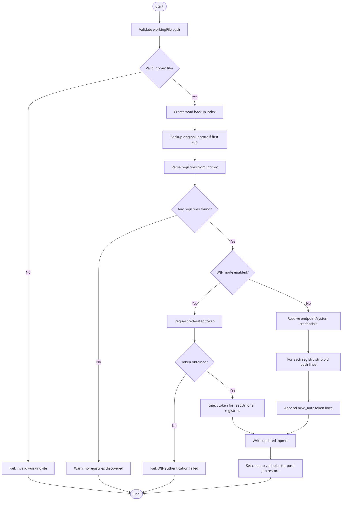

# NpmAuthenticateV0 — npm Authenticate

Authenticates npm for installing and publishing packages from Azure Artifacts feeds and external npm registries. Credentials are written directly into the specified `.npmrc` file so that subsequent `npm` and `yarn` commands work without further configuration. The original `.npmrc` is restored after the build completes.

## Requirements

| | Minimum version |
|-|----------------|
| Agent | 2.144.0 |

## Usage

```yaml
- task: NpmAuthenticate@0
  inputs:
    workingFile: ''                          # required — path to .npmrc file
    customEndpoint: ''                       # optional — external registry service connections
    workloadIdentityServiceConnection: ''    # optional (WIF mode) — Entra WIF service connection
    feedUrl: ''                              # optional (WIF mode) — feed URL to authenticate
```

## Inputs

| Input | Type | Required | Default | Description |
|-------|------|----------|---------|-------------|
| `workingFile` | file path | Yes | — | Path to the `.npmrc` file that lists the registries to authenticate. Select the file, not the folder, e.g. `/packages/mypackage.npmrc`. |
| `customEndpoint` | service connection (multi-select) | No | — | Credentials for external registries listed in the `.npmrc`. For registries in this organization, leave blank — build credentials are used automatically. |
| `workloadIdentityServiceConnection` | service connection | No (WIF mode) | — | Entra WIF service connection used to obtain a short-lived federated token. |
| `feedUrl` | string | No (WIF mode) | — | Full URL of the feed to authenticate with the WIF service connection. When omitted, all registries in the `.npmrc` are authenticated via WIF. |

## Files read and written

| File | Purpose |
|------|---------|
| The `.npmrc` specified by `workingFile` | Modified in-place: existing credential lines for a registry are stripped and new ones are appended. |
| `$Agent.TempDirectory/npmAuthenticate/<random>/index.json` | Tracks which `.npmrc` files have been backed up and under what ID. Shared across multiple NpmAuthenticate task invocations in the same job. |
| `$Agent.TempDirectory/npmAuthenticate/<random>/<id>` | A copy of the original `.npmrc` content taken before the first modification. Restored by the post-job cleanup step. |

## Pipeline variables set

| Variable | Description |
|----------|-------------|
| `SAVE_NPMRC_PATH` | Path to the random temp subdirectory holding backups and the index file. Read by the cleanup task to restore the original `.npmrc`. |
| `NPM_AUTHENTICATE_TEMP_DIRECTORY` | Path to the `npmAuthenticate` parent temp directory. Removed by the cleanup task after the last `.npmrc` is restored. |
| `EXISTING_ENDPOINTS` | Comma-separated list of registry URLs that have already had credentials injected this job. Used to detect and warn about duplicates across multiple task invocations. |

## Credential format written to .npmrc

For each authenticated registry, the task appends a line in npm's `_authToken` format:

```
//pkgs.dev.azure.com/myorg/_packaging/myfeed/npm/registry/:_authToken=<token>
```

Existing lines referencing the same registry host and path (excluding `registry=` lines) are blanked out before the new credential is appended, preventing stale or duplicate entries.

## Behavior

1. Validates that the specified file exists and ends with `.npmrc`.
2. Reads or creates a backup index in `$SAVE_NPMRC_PATH/index.json`. Backs up the `.npmrc` only on the first invocation per file per job — re-running the task on the same `.npmrc` later in the job does not overwrite the original backup.
3. Parses the `.npmrc` to discover all registry URLs.
4. For each registry URL, resolves credentials in priority order:
   - **WIF** (`workloadIdentityServiceConnection`): injects `_authToken` from a federated token. Optionally scoped to a single `feedUrl`.
   - **Service endpoint** (`customEndpoint`): uses the matched service connection credentials.
   - **Internal (automatic)**: uses the pipeline's `System.AccessToken`.
5. Strips any pre-existing credential lines for a registry before appending new ones.
6. At job end, the built-in cleanup task reads `SAVE_NPMRC_PATH` and restores the original `.npmrc`.

## Examples

### Install packages from an internal Azure Artifacts feed

```yaml
steps:
- task: NpmAuthenticate@0
  inputs:
    workingFile: '.npmrc'

- script: npm install
```

### Install from both internal and external registries

```yaml
steps:
- task: NpmAuthenticate@0
  inputs:
    workingFile: '.npmrc'
    customEndpoint: 'MyExternalNpmRegistry'

- script: npm install
```

## Valid `.npmrc` patterns

Use registry lines in one of these common forms:

```ini
registry=https://registry.npmjs.org/
@my-scope:registry=https://pkgs.dev.azure.com/myorg/_packaging/myfeed/npm/registry/
```

Or feed-only `.npmrc`:

```ini
registry=https://pkgs.dev.azure.com/myorg/_packaging/myfeed/npm/registry/
always-auth=true
```

## Scoped registry example

```yaml
steps:
- task: NpmAuthenticate@0
  inputs:
    workingFile: '.npmrc'

- script: npm ci
```

```ini
# .npmrc in repo
@my-team:registry=https://pkgs.dev.azure.com/myorg/_packaging/myfeed/npm/registry/
```

## Task flow



## Troubleshooting

- **Task says no registries found**: Ensure `workingFile` points to a real `.npmrc` file (not a directory) and that it contains at least one `registry=` or `<scope>:registry=` line.
- **401/403 on npm install**: Confirm the registry URL is correct and the pipeline identity (or selected service connection) has feed read permission.
- **Credentials duplicated across runs**: Multiple `NpmAuthenticate@0` calls in one job can warn on existing endpoints; this is expected and the task deduplicates by stripping old auth lines.
- **Wrong endpoint token used**: If both internal and external entries exist, confirm `customEndpoint` maps to the external host in `.npmrc`.
- **Yarn still fails**: Verify yarn uses the same `.npmrc` path in the same working directory as the authenticated file.
