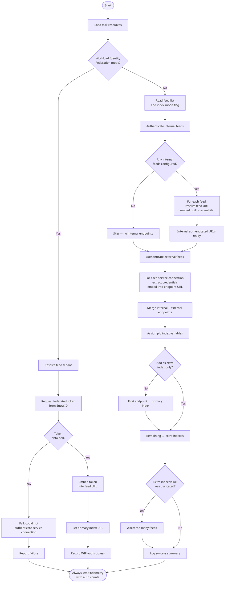

# PipAuthenticateV1 — Python pip Authenticate

Authenticates pip for installing Python packages from Azure Artifacts feeds and external package indexes. Sets the `PIP_INDEX_URL` and `PIP_EXTRA_INDEX_URL` environment variables so that subsequent `pip install` commands work without further configuration.

## Requirements

| | Minimum version |
|-|----------------|
| Agent | 2.144.0 |

## Usage

```yaml
- task: PipAuthenticate@1
  inputs:
    artifactFeeds: ''                        # optional — internal feeds (comma-separated)
    pythonDownloadServiceConnections: ''     # optional — external indexes (comma-separated)
    onlyAddExtraIndex: false                 # optional — set true to skip PIP_INDEX_URL
    workloadIdentityServiceConnection: ''    # optional — Entra WIF service connection
    feedUrl: ''                              # optional — full feed URL (required with WIF)
```

Authentication mode is determined by inputs:
- If both `workloadIdentityServiceConnection` and `feedUrl` are set, WIF mode is used and standard inputs are ignored.
- If neither WIF input is set, standard mode is used with `artifactFeeds` and/or `pythonDownloadServiceConnections`.
- If only one WIF input is set, the task fails.

## Inputs

| Input | Type | Required | Default | Description |
|-------|------|----------|---------|-------------|
| `artifactFeeds` | pick list (multi-select) | No (standard mode) | — | One or more Azure Artifacts feeds in this organization to authenticate. |
| `pythonDownloadServiceConnections` | service connection (multi-select) | No (standard mode) | — | One or more service connections for external Python package indexes. |
| `onlyAddExtraIndex` | boolean | No | `false` | When `true`, all feeds are added as **extra** index URLs only (`PIP_EXTRA_INDEX_URL`). No feed is set as the primary index (`PIP_INDEX_URL`). Useful when you want PyPI as the primary source and Azure Artifacts as a fallback. |
| `workloadIdentityServiceConnection` | service connection | Required in WIF mode (with `feedUrl`) | — | Entra WIF service connection used to obtain a short-lived federated token. |
| `feedUrl` | string | Required in WIF mode (with `workloadIdentityServiceConnection`) | — | Full feed URL for the authenticated pip index, e.g. `https://pkgs.dev.azure.com/myorg/_packaging/myfeed/pypi/simple/`. |

Input rules:
- Standard mode: provide at least one of `artifactFeeds` or `pythonDownloadServiceConnections`.
- WIF mode: provide both `workloadIdentityServiceConnection` and `feedUrl`.
- Mixed mode: if both WIF inputs are present, standard inputs and `onlyAddExtraIndex` are ignored.
- If standard mode is used with no standard inputs, no usable pip auth variables are produced.

## Behavior

1. Generates authenticated URLs for each selected feed/endpoint.
2. Sets environment variables for the duration of the job:
   - First feed → `PIP_INDEX_URL` (unless `onlyAddExtraIndex` is `true`)
   - Additional feeds → `PIP_EXTRA_INDEX_URL`
3. Subsequent `pip install` commands pick up the variables automatically.

## Environment variables set

| Variable | Description |
|----------|-------------|
| `PIP_INDEX_URL` | Primary authenticated index URL (omitted when `onlyAddExtraIndex: true`) |
| `PIP_EXTRA_INDEX_URL` | Space-separated additional authenticated index URLs |

## Examples

### Install from a single internal feed

```yaml
steps:
- task: UsePythonVersion@0
  inputs:
    versionSpec: '3.x'

- task: PipAuthenticate@1
  inputs:
    artifactFeeds: 'MyPythonFeed'

- script: pip install mypackage
```

### Install from multiple feeds (internal + external)

```yaml
steps:
- task: PipAuthenticate@1
  inputs:
    artifactFeeds: 'MyInternalFeed'
    pythonDownloadServiceConnections: 'MyExternalPyPIConnection'

- script: pip install -r requirements.txt
```

### Use Azure Artifacts as a supplemental index (PyPI first)

```yaml
steps:
- task: PipAuthenticate@1
  inputs:
    artifactFeeds: 'MyInternalFeed'
    onlyAddExtraIndex: true

- script: pip install -r requirements.txt
  # Pip will try PyPI first, then fall back to MyInternalFeed
```

### Use with a requirements file

```yaml
steps:
- task: PipAuthenticate@1
  inputs:
    artifactFeeds: 'MyPythonFeed'

- script: pip install -r requirements.txt
  workingDirectory: $(Build.SourcesDirectory)
```

## Workload Identity Federation (WIF)

Use WIF when you want short-lived federated credentials instead of stored secrets.

```yaml
- task: PipAuthenticate@1
  inputs:
    workloadIdentityServiceConnection: 'MyEntraWifConnection'
    feedUrl: 'https://pkgs.dev.azure.com/myorg/_packaging/myfeed/pypi/simple/'

- script: pip install -r requirements.txt
```

In WIF mode, `PIP_INDEX_URL` is set directly to the authenticated feed URL. The standard-mode inputs (`artifactFeeds`, `pythonDownloadServiceConnections`, and `onlyAddExtraIndex`) are **not** used in this path.

## Task flow



## Notes

- For feeds in this organization, build credentials are used automatically — no service connection is required.
- External service connections can use token or username/password credentials.

## See also

- [pip authenticate task documentation](https://docs.microsoft.com/azure/devops/pipelines/tasks/package/pip-authenticate)
- [pip install documentation](https://pip.pypa.io/en/stable/reference/pip_install/)
- [Publish and consume Python packages in Azure Artifacts](https://docs.microsoft.com/azure/devops/artifacts/quickstarts/python-packages)
