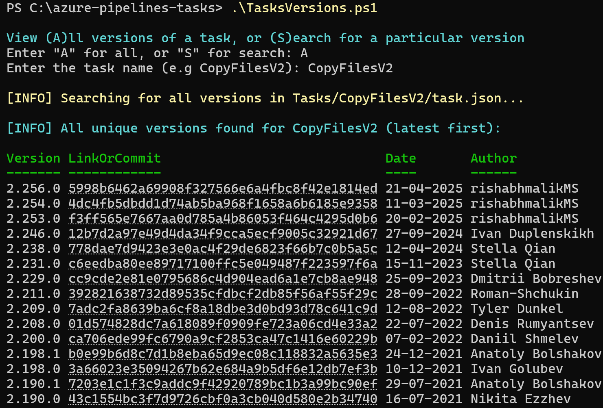
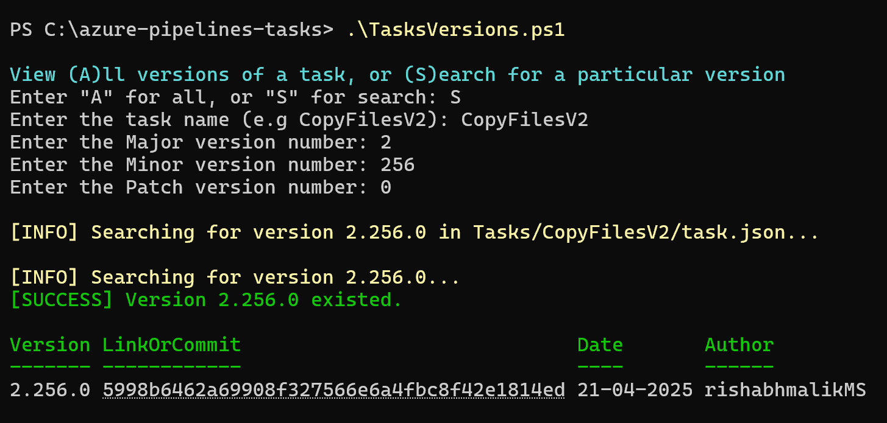

# TasksVersions.ps1 Documentation

## Overview
`TasksVersions.ps1` is a PowerShell script designed to list all unique versions of an Azure Pipelines task and show the commit link for each version. It also allows searching for a specific version based on `Major`, `Minor`, and `Patch` parameters.

## Features
- List all versions of a task.
- Search for a specific version using `Major`, `Minor`, and `Patch` parameters.
- Displays error messages for invalid or missing inputs.

## Usage

### Parameters
- **TaskName**: The name of the task (e.g., `CopyFilesV2`).
- **Major**: The major version number.
- **Minor**: The minor version number.
- **Patch**: The patch version number.

### Behaviors
#### View All Versions
1. Run the script.
2. Select the option to view all versions.
3. Enter the task name.
4. The script lists all versions of the task.

#### Search for a Specific Version
1. Run the script.
2. Select the option to search for a specific version.
3. Enter the task name.
4. Provide values for `Major`, `Minor`, and `Patch`.
5. If any parameter is missing, the script displays an error and exits.
6. If all parameters are provided, the script searches for the exact version and displays the result.

#### Error Handling
- If the task name is empty, the script displays an error:
  ```
  Task name cannot be empty. Please provide a valid task name.
  ```

- If the task does not exist, the script displays an error:
  ```
  Task not found: <TaskName>. Please check the task name and try again.
  ```

- If any version parameter (`Major`, `Minor`, or `Patch`) is missing during a search, the script displays an error:
  ```
  All parameters (Major, Minor, Patch) are required for search. Please provide valid values.
  ```

## Examples
### View All Versions


### Search for a Specific Version


## Notes
- Ensure the `task.json` file exists in the `Tasks/<TaskName>/` directory.
- The script requires PowerShell to run.

