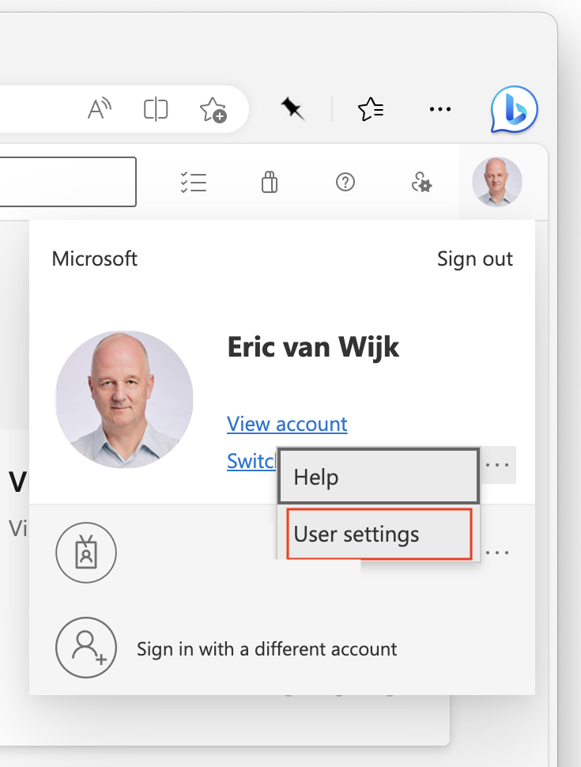
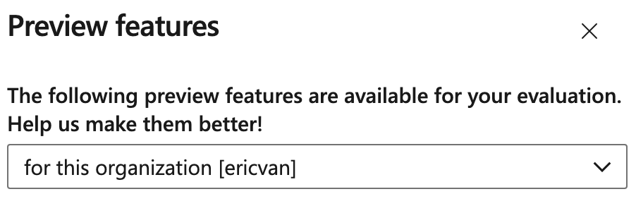
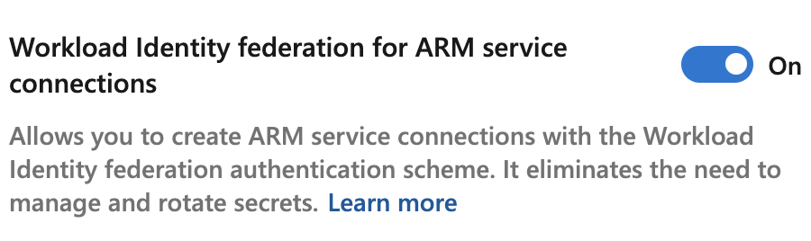
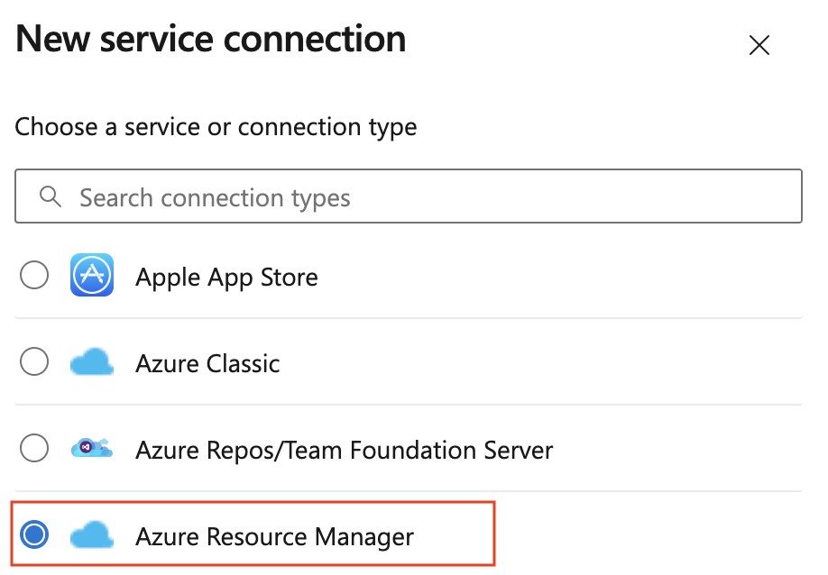
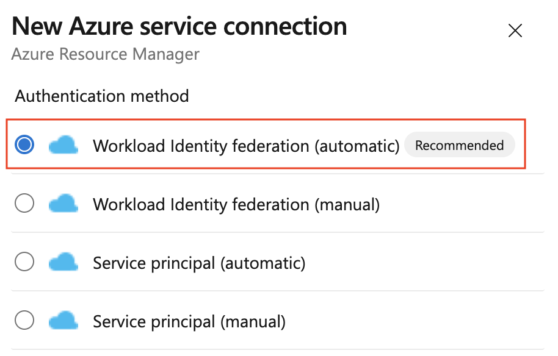
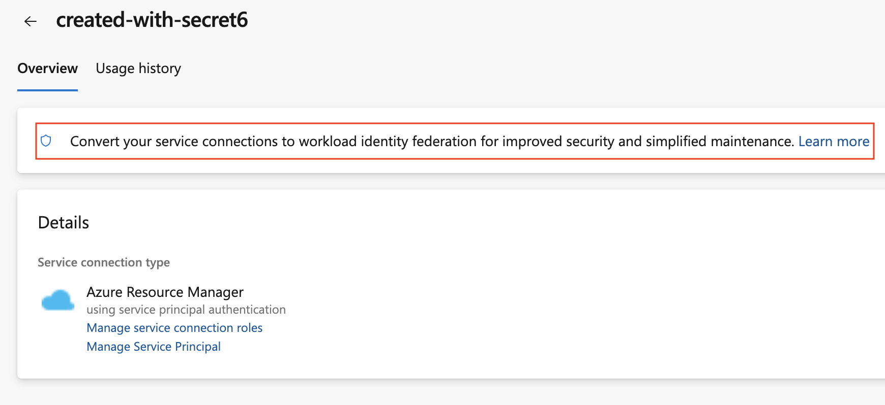

## Pages

#### [Manual Configuration](manual-configuration.md)
#### [Troubleshooting & Frequently Asked Questions](troubleshooting.md)

# Workload Identity federation (preview) - Getting Started

## What is Workload identity federation?

Workload identity federation is an industry term & technology leveraging Open ID Connect (OIDC) to authenticate using client assertions. Instead of secrets, a federation subject is used. This eliminates the need to manage and rotate secrets. See [Entra doc page](https://learn.microsoft.com/azure/active-directory/workload-identities/workload-identity-federation "https://learn.microsoft.com/azure/active-directory/workload-identities/workload-identity-federation") for more detail.

### Azure Service Connections schemes compared

|                                                            | Service Principal with secret | Agent-assigned Managed Identity | Service Principal or Managed Identity with federation |
|------------------------------------------------------------|-------------------------------|---------------------------------|-----------------------------------|
| Secret-free                                                | No                            | Yes                             | Yes                               |
| Constrains usage to                                        | Service Connection only       | Any process on the agent        | Service Connection only           |
| Works universally (Microsoft-hosted, Self-hosted, on prem) | Yes                           | No                              | Yes                               |
| Pipeline author-time Azure resource experience             | Yes                           | No                              | Yes                               |

## Scope

Currently, the [Azure (ARM) Service Connection](https://learn.microsoft.com/azure/devops/pipelines/library/connect-to-azure?view=azure-devops "https://learn.microsoft.com/azure/devops/pipelines/library/connect-to-azure?view=azure-devops") has been updated with an additional scheme to support Workload identity federation. This allows Pipeline tasks that use the Azure Service Connection to authenticate using a federation subject (`sc://<org>/<project>/<service connection name>`). 

## Enable feature

If not yet enabled, the preview needs to be enabled at organization level:

 

 

​​​​​​​Make sure **users in your organization are aware this is a preview feature**.

Workload identity federation can be configured in 2 ways:

### Creating a new Azure Service Connection

 

### Convert an existing Service Connection

