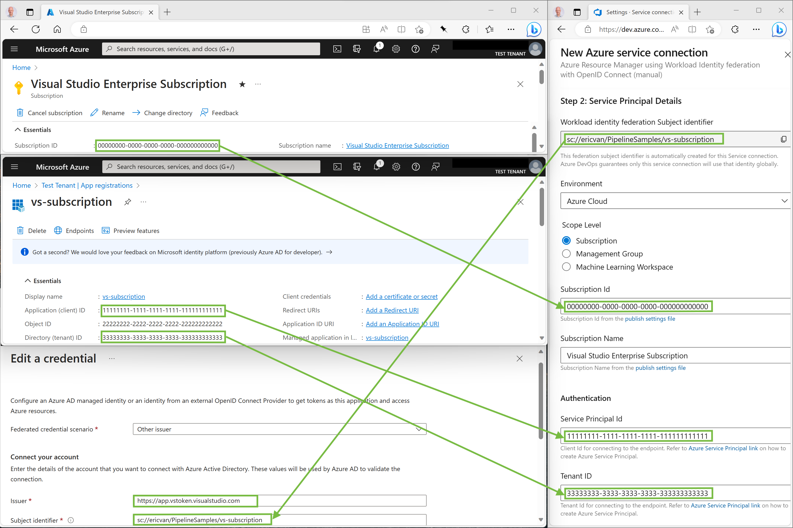
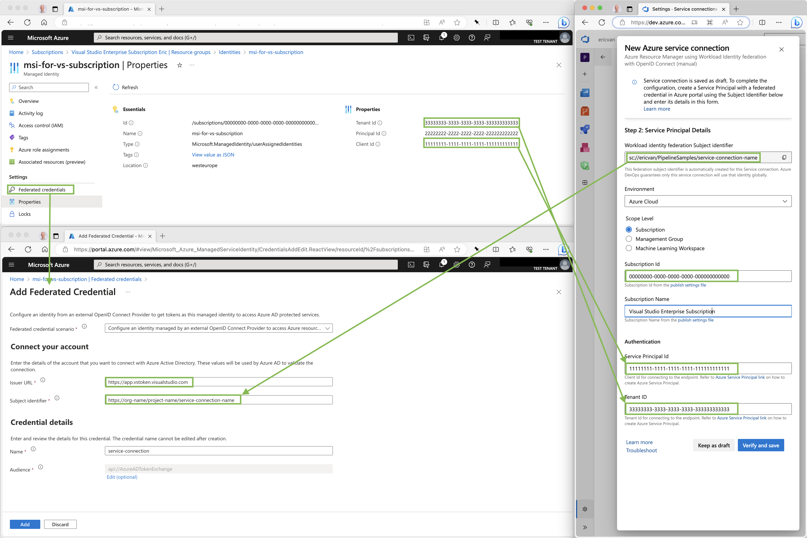

## Pages

#### [Getting Started](README.md)
#### [Troubleshooting & Frequently Asked Questions](troubleshooting.md)

# Workload Identity federation (preview) - Manual Configuration

In case a user does not have the permission to create Service Principals, or the Azure Active Directory tenant of the Service Connection is different from the user's tenant, you need create the Service Principal used by the Service Connection manually. Below are the steps needed to set that up.

## Create Service Principal

-   Go to the [Azure Portal](https://portal.azure.com/#view/Microsoft_AAD_IAM/ActiveDirectoryMenuBlade/~/RegisteredApps) or [Azure Active Directory Portal](https://aad.portal.azure.com/#view/Microsoft_AAD_IAM/ActiveDirectoryMenuBlade/~/RegisteredApps)
-   Click on the 'New registration' link:
     
-   Give the new App Registration a name
-   Take note of the essentials of the app registration (client ID & tenant ID) as those will be needed later
-   Navigate to 'Certificates & secrets':
     
-   Select 'Federated Credentials':
      
    (Note: if you don't see 'Federated credentials', disable any adblocker browser extensions you may use and refresh your browser)
-   Select 'Add Credentials' and then 'Other issuer'
-   For the issuer url specify `https://app.vstoken.visualstudio.com` (no trailing '/')
-   For the subject identifier specify `sc://<Azure DevOps organization>/<Project name>/<Service Connection name>`
    (The Service Connection does not have to be created yet)

## Grant permissions

The Service Principal created needs to be given access to the target Azure scope e.g. an Azure Subscription. This is done under Access Control (IAM):

## Create Service Connection

Populate Service Principal & subscription details as per below screenshot:

## Federated Managed Identity

Instead of a Service Principal, you can also configure a Managed Identity:

